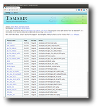
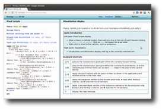
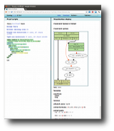

# Tamarin Prover

The Tamarin prover is a security protocol verification tool that
supports both falsification and unbounded verification of security
protocols specified as multiset rewriting systems with respect to
(temporal) first-order properties and a message theory that models
Diffie-Hellman exponentiation combined with a user-defined
subterm-convergent rewriting theory.

Authors: [Simon Meier](mailto:iridcode@gmail.com), [Benedikt Schmidt](http://beschmi.net)

Contributors: [Cas Cremers](http://www.cs.ox.ac.uk/people/cas.cremers/), [Cedric Staub](http://cssx.ch/)

## Research Papers and Theses

* S&P 2014 paper [[PDF]](http://www.infsec.ethz.ch/research/tamarin_group_sp.pdf) : the paper presented at [S&P](http://www.ieee-security.org/TC/SP2014/).
* CSF 2012 paper [[PDF]](http://www.infsec.ethz.ch/research/dh_tamarin_csf.pdf) : the paper presented at [CSF](http://csf2012.seas.harvard.edu/).
* Extended version [[PDF]](http://www.infsec.ethz.ch/research/dh_tamarin_extended_v1.pdf) : extended version of the above paper that contains the full proofs and additional examples.
* Meier's PhD thesis [[PDF]](http://dx.doi.org/10.3929/ethz-a-009790675): provides a detailed explanation of the theory and implementation of Tamarin including inductive invariants and type assertions.
* Schmidt's PhD thesis [[PDF]](http://e-collection.library.ethz.ch/view/eth:7065): provides a detailed explanation of the theory and application of Tamarin including the reasoning about Diffie-Hellman exponentiation and bilinear pairing.
* Staub's bachelor thesis [[PDF]](http://dx.doi.org/10.3929/ethz-a-007554462): about the implementation of the original version of Tamarin's GUI.
* Keller's bachelor thesis [[PDF]](http://www.infsec.ethz.ch/research/thesis_keller_alicebob.pdf): about translating Alice&Bob protocol notation into Tamarin's input language, with implementation available [[tar.gz]](http://www.infsec.ethz.ch/research/anb.tar.gz).

## Screenshots

<table width="100%" cellspacing="0" cellpadding="3">
<tr>
<td>
  
  
Introduction page

</td>
<td>
  
  
Overview

</td>
<td>
  
  
Tamarin Attack Display

</td>
</tr>
</table>

## Sourcecode and Mailing List

The Tamarin prover is open-source software. Its code and issue tracker
are available at https://github.com/tamarin-prover/tamarin-prover. Its
low-volume mailing list for announcements and discussion is
https://groups.google.com/group/tamarin-prover.

## Installation

The Tamarin prover is implemented in Haskell and available from
Hackage. It uses maude as a unification backend and GraphViz to
visualize the constraint systems. It compiles on Linux, Mac OS X, and
Windows using GHC 7.0, 7.2, and 7.4. Below we give step-by-step
instructions for installing the Tamarin prover from source code on
Linux and Mac OS X. If you cannot compile from source code, you can
try the binaries for Windows and Mac OS X. Please do not hesitate to
contact us, if you encounter trouble installing or using the Tamarin
prover.

### Linux

1. Use your package manager to install maude, graphviz, and the zlib1g
   header files. On Ubuntu 11.10:

    `sudo apt-get install maude graphviz zlib1g-dev`

2. Use your package manger to install the Haskell platform, if available.
   Otherwise, install GHC 7.x, cabal-install, alex and happy. On Ubuntu 11.10:

    `sudo apt-get install ghc happy alex cabal-install`

3. Update the package database of the Haskell cabal tool

    `cabal update`

   and install the Tamarin prover together with all its Haskell library
   dependencies, which might take some time. cabal install tamarin-prover
   In some cases you might have to add the flag --force-reinstalls, as
   explained by the message output by cabal. Depending on your Linux
   distribution installing some of the dependencies might fail due to
   missing development packages. Check the installation log for the
   missing C-library and use your package manager to install the
   corresponding '-dev' package; e.g., zlib1g-dev for the zlib
   compression library on Ubuntu.

4. The 'tamarin-prover' executable is installed in '~/.cabal/bin'.
   Add this directory to your PATH or call
   the Tamarin prover as follows.

    `~/.cabal/bin/tamarin-prover`
   
   This will display the possible options for calling the Tamarin
   prover. It also outputs the paths to the installed example protocol
   models and the case studies from our paper. We recommend opening
   the Tutorial.spthy example file in a text editor and start
   exploring from there.
   
Happy proving :-)

### Mac OS X

1. Install Core Maude 2.6 and graphviz and make sure that they are on your PATH. 
2. Install the Haskell platform for Mac.
3. Update the package database of the Haskell cabal tool

    `cabal update`

   and install the Tamarin prover together with all its Haskell library dependencies, which might take some time.

    `cabal install tamarin-prover`

   The 'tamarin-prover' executable is installed in '~/Library/Haskell/bin'.
   Add this directory to your PATH or call the Tamarin prover as follows.

    `~/Library/Haskell/bin/tamarin-prover`
    
   Note that if you already have installed an older version of
   tamarin, 'tamarin-prover' can be found in a different directory
   which is printed at the end of the installation. The above command
   invocation will display the possible options for calling the
   Tamarin prover. It also outputs the paths to the installed example
   protocol models and the case studies from our paper. We recommend
   opening the Tutorial.spthy example file in a text editor and start
   exploring from there.

Happy proving :-)
